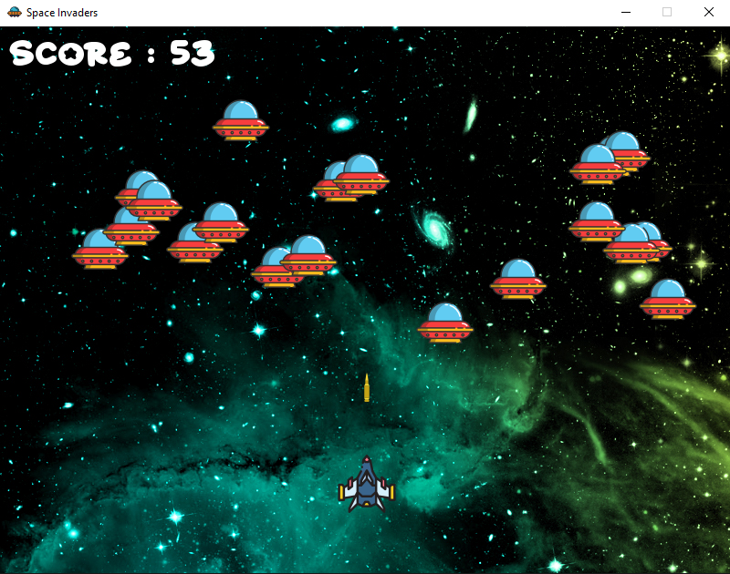

# 🚀 Alien Invasion — Pygame Arcade Shooter

A **classic Space Invaders–style arcade game** built with **Python** and **Pygame**. Pilot your spaceship, destroy waves of alien enemies, and achieve the highest score possible!  

 <!-- replace with your screenshot -->

---

## 🎮 Gameplay

- Move your spaceship **left and right** using arrow keys  
- Press **SPACE** to fire bullets  
- Destroy enemies before they reach your spaceship  
- Score points for every enemy destroyed  
- **Game Over** occurs when enemies pass your defense line  

---

## ✨ Features

- Smooth spaceship movement and shooting mechanics  
- Multiple enemies with randomized spawning positions  
- Collision detection for bullets and enemies  
- Score tracking system displayed on screen  
- Retro-inspired background, music, and sound effects  
- Game Over screen with final score  

---

## 🛠️ Built With

- **Python 3**  
- **Pygame** (for graphics, input, and sound)  
- **Pygame Mixer** (for background music and sound effects)  

---

## 📁 Project Structure

```

Alien-Invasion/
├── main.py             # Game code
├── Background.png      # Background image
├── spaceship.png       # Player spaceship
├── enemy.png           # Enemy sprite
├── bullet.png          # Bullet sprite
├── laser.wav           # Shooting sound
├── explosion.wav       # Enemy destroyed sound
├── background_music.mp3 # Background music
├── Starborn.ttf        # Custom game font
└── README.md           # Project documentation

````

---

## ▶️ How to Run

1. Install Pygame:

```bash
pip install pygame
````

2. Run the game:

```bash
python main.py
```

Make sure all **assets (images, sounds, fonts)** are in the same folder as `main.py`.

---

## 💡 Tips

* Customize enemy speed or bullet speed in the code for different difficulty levels
* Replace background music or sprites to make the game your own


